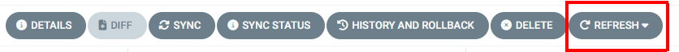

# Chart Helm de démonstration DSO

## Présentation

Ce tutoriel permet de déployer l'application qui a été construite lors du tutoriel [https://github.com/cloud-pi-native/formation-cpin-repo-applicatif](https://github.com/cloud-pi-native/formation-cpin-repo-applicatif)

Le déploiement d'un applicatif sur CPiN passe par la création d'un repo de code applicatif contenant les éléments d'infrastructure Kubernetes et/ou Openshift (manifest yaml, chart HELM ou Kustomize). Dans cet exemple, le code d'infrastructure est un chart HELM qui déploie l'image tuto-java créé précédemment.


Ce chart permet de créer :
 - Appel au chart HELM par déclaration de dépendance pour la création d'une instance PosgreSQL / Bitnami
 - Création d'un déploiement de l'image construite lors du TP précédent.
 - Création d'un service sur le déploiement
 - Création d'un ingress en https vers le service

> Il est nécessaire d'avoir construit au préalable l'image tuto-java détaillée dans le tutoriel : [https://github.com/cloud-pi-native/formation-cpin-repo-applicatif](https://github.com/cloud-pi-native/formation-cpin-repo-applicatif). Il est indispensable d'avoir terminé ce tutoriel avant de poursuivre ce tutoriel.

## Intégration à la chaine CPiN

### Ajout du dépôt externe

Nous allons détailler l'intégration du repo d'infra de démo à l'offre Cloud Pi Native sur la plateforme d'accéleration.

Dans un premier temps il est nécessaire d'ajouter le *repo de code* d'infrastructure au projet contenant la construction de l'applicatoin tuto-java :

1. Depuis son *projet*, aller dans l'onglet *Dépôt*, puis *ajouter un nouveau dépôt* :

 - *Nom du dépôt Git interne* : demo-java-infra

Le repo contient du code d'infrastructure donc cochez la case *Dépôt contenant du code d'infrastructure*.

2. Renseigner *l'URL du repo externe* [https://github.com/cloud-pi-native/tuto-java-infra-helm.git](https://github.com/cloud-pi-native/tuto-java-infra-helm.git). Le repo est public, laissez donc décoché la case *Dépôt de source privé*

Compléter les éléments suivants qui permettent de piloter la configuration d'ArgoCD : 
 - Nom de la branche du repo a utiliser pour le déploiement (par défaut HEAD), préciser ```tuto```
 - Chemin dans le repo pour arriver à la racine du déploiement, préciser ```./```
 - fichiers values à ajouter au chart. Par defaut, values.yaml. Il est possible de faire un template avec ```<env>``` pour utiliser par exemple values-dev.yaml sur l'environnement de dev et values-integ.yaml pour l'environnement d'intégration. Dans le cadre du tuto, mettre ```values-scw.yaml```

Cliquez sur le bouton *Ajouter le dépôt* et attendre que le dépôt apparaisse dans la console.

3. depuis l'onglet *Services externes* vérifier en cliquant sur le service Gitlab que le dépôt *demo-java-infra* est bien présent dans ses projets gitlab.

### Création d'un environnement

Afin de déployer l'application, il est nécessaire de créer un environnement depuis la console. Pour cela, aller dans le menu *Environnements* puis cliquez sur le bouton "+Ajouter un nouvel environnement" :
 - Nom : Donnez un nom logique à l'environnement : demo, dev, integ, prd, etc. Il est conseillé de choisir des noms cours car le nom est utilisé dans les objets Kubernetes créés or ceux-ci sont limité à 63 caractère au total. Pour le tutoriel, choisir *tuto*
 - Choisir une zone : sur l'environnement d'accélération, une seule zone est disponible: *Zone défaut*.
 - Type d'environnement: choisir *dev*. Le choix d'un type d'environnement permet de filtre les dimmensionnements proposés
 - Dimensionnement: choisir *small*. le dimensionnement appose un quota de ressource sur le namespace correspondant au projet.
 - Cluster : choisir le cluster *formation-app* (ce cluster est dédié aux exercices et peut être facilement purgé)

Décocher la case ```Synchronisation automatique``` afin d'éviter de commencer à déployer le projet tant qu'il n'est pas complètement configuré.

Cliquez sur le bouton *Ajouter l'environnement* et attendre que l'environnement soir créé dans la console et apparaisse dans la liste des environnements de son projet.

## Déploiement de l'application

Lorsqu'un projet contient un repo d'infrastructure et (au moins) un environnement, la console crée automatiquement les applications *ArgoCD* associées. Ainsi, depuis le menu gauche  *Services externes* cliquez sur la tuile *ArgoCD DSO* puis le bouton *login via Keycloak* et vérifier que vous retrouvez votre application et cliquez sur la tuile correspondant à votre application. L'application apparait en erreur, c'est normal à ce stade et nous allons corriger les différents points.


### ArgoCD

Depuis la console CPiN aller sur la tuile ArgoCD


Une fois connecté à ArgoCD, plusieurs applications sont visibles, par exemple pour le projet **stform**, l'envrionnement **demo** et le repo **infra** : 


Voici les différentes application ArgoCD présentes :
 - hprod-stform-observability : Cette application correspond au déploiement des dashboard as code (voir le tuto sur l'observabilité). Une autre application nommée "prod" et non "hprod-[nom_projet]-observability" peut également être présente si au moins un environnement de type production est déployé. 
 - stform-demo-[id]-env : Cette application ArgoCD correspond aux éléments d'infrastructure déployé au sein de son namespace : registry pull secret pour la récupération des images sur Harbor par exemple  (à ne pas modifier)
 - stform-formation-app-demo-root : App of apps permettant de piloter l'ensemble des applis de son projet (à ne pas modifier)
 - stform-demo-[id]-infra-[id] : correspond à l'application ArgoCD du repo infra que l'on déclaré depuis la console, c'est l'application correspondant à notre déploiement.

L'application est créée avec les paramètres fournies par la console. Afin de vérifier ses paramètres, depuis l'application ArgoCD, choiusir son application de type stform-demo-[id]-infra-[id] puis cliquez sur le bouton *Details* en haut à gauche. Ce menu présente les informations principales de l'application ArgoCD :
- Le cluster et le namespace de déploiement
- Le repo Git associé (repo d'infrastructure)
- La branche utilisée sur le repo
- Le répertoire dans lequel chercher les éléments d'infrastructure.

> Il n'est pas possible de modifier ces éléments depuis cette IHM ArgoCD. Pour modifier les éléments, il est nécessaire de modifier le repo de code depuis la console.

Les éléments à vérifier de façon générales sont : 
 - La branche utilisée, par defaut il s'agit de la branche principale du repo, mais il est possible suivant le cas de modifier cette branche. Par exemple, pour utiliser la branche develop ou dso du projet, il est nécessaire d'éditer cette information depuis la console pour remplacer *HEAD* par le nom de la branche à utiliser. Pour notre exemple, utilisez la branche tuto.
 - Le répertoire dans lequel chercher les éléments d'infrastructure : Par defaut, la console prépositionne un répertoire *./* à la racine du projet. Si ce n'est pas le cas il est possible d'éditer cette information pour remplacer le nom du répertoire contenant le code d'infrastructure.

Comme la case ```Synchronisation automatique``` a été désactivée depuis la console il est nécessaire de déployer l'application à la main. Pour cela, cliquez sur le bouton Refresh dans le menu haut pour déployer l'application. 



L'application est en erreur car différents éléments de configuration ne sont pas corrects.

### Configuration de l'application

L'application n'est pas opéraitonnelle pour 2 raisons : 
 - Les références à Harbor ne sont pas corrects
 - L'URL de déploiement de l'application n'est pas correcte.

L'application déployée n'est pas fonctionnelle, et certains éléments apparaissent sous la forme d'un petit coeur brisé.

Il est possible de consulter les événements en erreur en cliquant sur le POD puis en allant sur l'onglet *EVENTS*. A noter qu'il est églament possible de consulter les logs des PODS sur l'onglet *LOGS* situé à côté. 

Le fonctionnement standard de CPiN est de modifier le fichier values avec les bons paramètres depuis le repo externe sur Github puis de procéder à une synchronisation. pour des raisons de facilité (notamment pour éviter à tout le monde de modifier la source github), nous allons modifier directement le fichier values sur gitlab CPiN

1. Depuis Gitlab, aller dans le projet *demo-java-infra* et choisir la branche *tuto* puis sur le bouton *edit* -> *web IDE* créer un fichier values-demo.yaml

2. Ajouter le contenu suivant: 
```yaml
image:
  repository: harbor.dso.formation.numerique-interieur.fr/form-tuto/java-demo
  tag: "tuto"

ingress:
  host: mon-appli.app.formation.numerique-interieur.fr

```

Adapter le contenu en fonction de votre projet :
 - **image.repository** : correspond à l'emplacement de l'image construite dans le tuto précédent et deployée sur Harbor. Pour connaitre l'emplacement, depuis la console, aller sur le menu *Tableau de bord* de son projet puis cliquez sur le bouton *Afficher les secrets des services* dans le bloc *Harbor* est précisé la racine de déploiement des images du projet, par exemple *harbor.dso.formation.numerique-interieur.fr/stform/*. Attention, lors de la modification de conserver le nom de l'image construite (/java-demo) dans l'URL du repo par exemple harbor.dso.formation.numerique-interieur.fr/stform/**java-demo**
 - **tag**: tag de l'image associé à **image.repository**, pour le tuto mettre *tuto*
 - **ingress.host** : Nom DNS de l'application. Sur l'environnement d'accélération, la génération des DNS et des certiifcats est automatiquement géré en respectant les sous domaines liés aux clusters. La documentation présente ce point [ici](https://github.com/cloud-pi-native/documentation-pax/blob/main/specificite-public-cloud.md?ref_type=heads). Pour le tutoriel, mettre un nom de la forme <NOM_APPLI>.app.formation.numerique-interieur.fr /!\ Attention /!\  ce nom doit être unique.


Une fois que ce fichier est créé et commit / push sur le repos git de gitlab, retourner sur la console CPiN et aller sur le repo d'infrastructure dans la partie *Fichiers values (Helm)* ajouter une ligne en desous de values-scw.yaml nommée *values-demo.yaml* et correspondant au fichier que l'on vient de créer.

Aller ensuite sur ArgoCD sur son application et cliquez sur le bouton *REFRESH* pour voir appliquer les modifications.

### Vérification

Une fois le déploiement terminé et opérationnel, ouvrir un navigateur et vérifier votre l'URL que vous avez saisie dans le fichier *values-demo.yaml* sur la clé **ingress.host** https://<NOM_APPLI>.app.formation.numerique-interieur.fr/api/demo/demo

Il est également possible, depuis ArgoCD de cliquer sur la 3ème icone de l'objet Ingress qui ouvre directement une nouvelle page sur l'URL de l'application.

Si tout est correctement configuré, vous devez avoir une liste au format JSON contenant la liste des personnes présentes en base de données de l'application de tuto.

```JSON
[
{
"id": 1,
"name": "Alice"
},
{
"id": 2,
"name": "Bob"
},
{
"id": 3,
"name": "Charles"
},
{
"id": 4,
"name": "Denis"
},
{
"id": 5,
"name": "Emily"
}
]
```

> Bravo vous avez terminé le tutoriel de déploiement !

