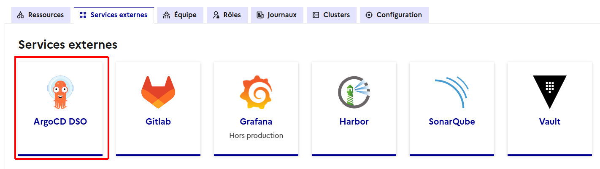
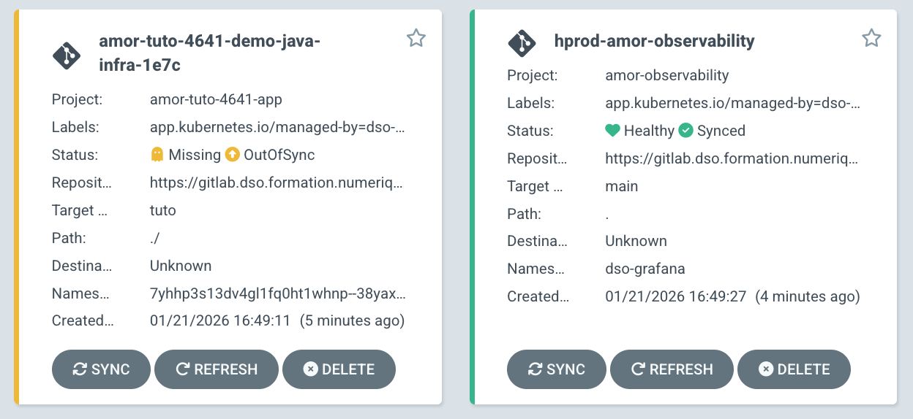
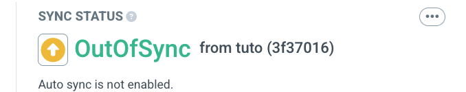
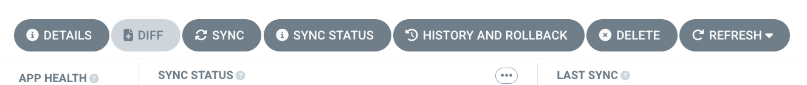
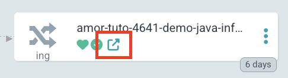

# Chart Helm de démonstration sur Cloud Pi Native

Vous en êtes à l'étape 4 de la formation CPiN :
1. [Gestion des projets CPiN](https://github.com/cloud-pi-native/formation-cpin-gestion-projet)
2. [Application d'exemple pour déploiement sur CPiN](https://github.com/cloud-pi-native/formation-cpin-repo-applicatif)
3. [Gestion des artefacts sur CPiN](https://github.com/cloud-pi-native/formation-cpin-harbor-trivy)
4. ➡️ [Chart Helm de démonstration sur CPiN](https://github.com/cloud-pi-native/formation-cpin-deploiement)
5. [Gestion des secrets sur CPIN](https://github.com/cloud-pi-native/formation-cpin-gestion-secret)
6. [Observabilité sur CPiN](https://github.com/cloud-pi-native/formation-cpin-observabilite)

## Présentation

> [!IMPORTANT]
> Il est nécessaire d'avoir construit au préalable l'image *java-demo* détaillée dans le tutoriel :
> [https://github.com/cloud-pi-native/formation-cpin-repo-applicatif](https://github.com/cloud-pi-native/formation-cpin-repo-applicatif).
> Il est indispensable d'avoir terminé ce tutoriel avant de poursuivre.

Le déploiement d'un applicatif sur CPiN passe par la création d'un dépôt de code applicatif contenant les éléments 
d'infrastructure Kubernetes et/ou Openshift (manifest yaml, chart HELM ou Kustomize). Dans cet exemple, le code 
d'infrastructure est un chart HELM qui déploie l'image ***java-demo*** créé précédemment.

Ce chart permet de :
 - Faire appel au chart HELM de création d'instance PosgreSQL / Bitnami par déclaration de dépendance
 - Créer un déploiement de l'image construite lors du TP précédent
 - Créer un service sur le déploiement
 - Créer un ingress en https vers le service

## Intégration à la chaine CPiN

### Ajout du dépôt externe

Nous allons détailler l'intégration du dépôt d'infra de démo à l'offre Cloud Pi Native sur la plateforme d'accéleration.

Dans un premier temps, il est nécessaire d'ajouter le **dépôt de code d'infrastructure** au projet contenant la 
construction de l'application *java-demo* :

▶️ Depuis votre *projet*, allez dans l'onglet `Dépôt`, puis `+ Ajouter un nouveau dépôt` :

▶️ Ajoutez un dépôt avec les paramètres suivants :
- `Nom du dépôt Git interne` : **demo-java-infra**
- `Dépôt contenant du code d'infrastructure` : **cochez la case**
- `Url du dépôt Git externe` : **https://github.com/cloud-pi-native/tuto-java-infra-helm.git**
- `Nom de la révision à déployer` : **tuto**
- `Chemin du répertoire à déployer` : **./**
- `Fichiers values` : **values-scw.yaml**

Les éléments de la section *Déploiement* servent à piloter la configuration d'ArgoCD.

> [!TIP]
> Dans le champ des fichiers *values*, il est possible d'utiliser un template avec le mot-clef `<env>`. Vous pouvez
> l'utiliser par exemple pour facilement déclarer l'utilisation d'un fichier *values-dev.yaml* pour l'environnement de 
> dev et *values-integ.yaml* pour l'environnement d'intégration. 

▶️ Cliquez sur le bouton `Ajouter le dépôt` et attendez que le dépôt apparaisse dans la console CPiN.

▶️ Depuis l'onglet `Services externes`, vérifiez en cliquant sur le service Gitlab que le dépôt *demo-java-infra* est 
bien présent dans vos projets gitlab.

### Création d'un environnement

Afin de déployer l'application, il est nécessaire de créer un environnement depuis la console CPiN.

▶️ Pour cela, allez dans l'onglet' `Ressources` puis dans le menu `Environnements`. Cliquez sur le bouton 
`+ Ajouter un nouvel environnement`. Utilisez les paramètres suivants :
 - `Nom de l'environnement` : **tuto**
 - `Zone` : **DSO** (sur l'environnement d'accélération, une seule zone est disponible)
 - `Type d'environnement` : **dev**
 - `Cluster` : **formation-app** (ce cluster est dédié aux exercices et peut être facilement purgé)
 - `Mémoire allouée` : 8
 - `CPU alloué` : 4
 - `GPU alloué` : 0
 - `Synchronisation automatique` : **décochez la case** (permet d'éviter de commencer à déployer le projet tant qu'il 
n'est pas complètement configuré)

> [!IMPORTANT]
> Pour vos futurs environnements, donnez-leur un nom logique (demo, dev, integ, prd, etc). Il est conseillé de choisir 
> des noms cours, car ce nom est réutilisé dans les objets Kubernetes dont le nom qui sont limité à 63 caractères.

> [!IMPORTANT]
> Le choix d'un type d'environnement permet de filtrer les dimensionnements proposés. Pour rappel, nous avions défini à 
> la création du projet, dans l'étape 1 de la formation, des valeurs de dimensionnement pour les environnements de
> *hors-production* et de *production*.

▶️ Cliquez sur le bouton `Ajouter l'environnement` et attendre que l'environnement apparaisse dans la console CPiN.

## Déploiement de l'application

Lorsqu'un projet contient un repo d'infrastructure et (au moins) un environnement, la console CPiN crée automatiquement 
les applications *ArgoCD* associées.

▶️ Depuis le menu `Services externes`, cliquez sur la tuile *ArgoCD DSO*. Authentifiez-vous en appuyant sur le bouton 
*login via Keycloak*.



> [!NOTE]
> Par défaut, en accédant à ArgoCD depuis la console CPiN, un filtre sur le nom de votre application est déjà appliqué. 
> Celle-ci peut mettre quelques minutes à s'afficher le temps qu'elle soit créée.

### ArgoCD

Une fois connecté à ArgoCD, deux applications sont visibles. Elles correspondent à votre infrastructure et votre stack 
d'observabilité. Vous devriez donc retrouver les deux applications suivantes :
- ***[nom d'app]-tuto-[id]-demo-java-infra*** : application ArgoCD du dépôt infra que l'on a déclaré depuis la console 
CPiN, c'est le déploiement de notre application
- ***hprod-[nom d'app]-observability*** : dashboards as code (sera abordé dans le tuto sur l'observabilité à l'étape 6)

> [!NOTE]
> Une autre application nommée *"prod-[nom_projet]-observability"* peut également être présente si au moins un 
> environnement de type production est déployé.



L'application est créée avec les paramètres fournis par la console CPiN.

▶️ Afin de vérifier ses paramètres, choisissez votre application de type ***[nom d'app]-tuto-[id]-demo-java-infra*** 
puis cliquez sur le bouton `Details` en haut à gauche. Ce menu présente les informations principales de l'application 
ArgoCD :
- Le cluster et le namespace de déploiement
- Le dépôt Git associé (*REPO URL*)
- La branche utilisée sur le dépôt (*TARGET REVISION*)
- Le répertoire dans lequel chercher les éléments d'infrastructure (*PATH*)

> [!NOTE]
> Il n'est pas possible de modifier ces éléments depuis cette IHM ArgoCD. Pour modifier les éléments, il est nécessaire 
> de modifier le dépôt de code depuis la console CPiN.

Les éléments à vérifier de façon générale sont : 
 - La branche utilisée par défaut, il s'agit de la branche principale du dépôt, mais il est possible suivant le cas de 
modifier cette branche. Il est courant d'utiliser la branche develop ou dso du projet selon votre workflow Git. Il est 
nécessaire d'éditer cette information depuis la console CPiN pour remplacer *HEAD* par le nom de la branche à utiliser 
dans le champ ***Nom de la révision à déployer***. Dans notre exemple, nous utilisons la branche tuto.
 - Le répertoire dans lequel chercher les éléments d'infrastructure : Par défaut, la console CPiN prépositionne un 
répertoire *./* à la racine du projet. Si vous avez un fonctionnement différent, il faut également mettre à jour cette 
information dans la console CPiN et remplacer la valeur du champ ***Chemin du répertoire à déployer***.

Puisque nous avons décoché la case ```Synchronisation automatique``` depuis la console CPiN, l'application devrait 
apparaitre dans un état *OutOfSync*.



▶️ Il est nécessaire de déployer l'application à la main. Pour cela, cliquez sur le bouton `SYNC` dans le menu haut puis
`SYNCHRONIZE` pour déployer l'application.



> [!IMPORTANT]
> Une fois que l'application est synchronisée, l'application devrait apparaitre en erreur. À ce stade, ce statut est 
> attendu parce qu'il manque encore quelques éléments de configuration.

### Configuration de l'application

L'application n'est pas opérationnelle pour 2 raisons : 
 - Les références à Harbor ne sont pas corrects
 - L'URL de déploiement de l'application n'est pas correcte

Avant de corriger ces informations, attardons-nous une minute sur la visualisation des détails de ces erreurs. 
Les éléments en erreur apparaissent sous la forme d'un petit cœur brisé 💔.

▶️ Consultez les événements en cliquant votre application puis sur le *POD* en erreur. Un panneau avec les détails du 
*POD* s'affiche, allez sur l'onglet `EVENTS`. À noter qu'il est également possible de consulter les logs des *PODS* sur 
l'onglet `LOGS` situé à côté.

Pour corriger les erreurs, nous allons ajouter un fichier *values* avec les paramètres manquants dans le dépôt Git.

> [!CAUTION]
> Pour rappel, le fonctionnement standard de CPiN serait de faire nos modifications depuis le dépôt externe sur Github 
> puis de procéder à une synchronisation via le pipeline de l'application *mirror*. Pour des raisons pratiques 
> (notamment pour éviter à tout le monde de modifier la même source github), nous allons ajouter le fichier *values* 
> directement dans votre dépôt gitlab CPiN.

▶️ Depuis Gitlab, allez dans le projet `demo-java-infra` et vérifiez que vous êtes bien à la racine du projet et sur la 
branche `tuto` en haut à gauche. Ensuite, cliquez sur le bouton `+`>`New file`. Appelez votre fichier 
`values-demo.yaml`.

▶️ Ajoutez le contenu suivant :
```yaml
image:
  repository: harbor.dso.formation.numerique-interieur.fr/[MON_APPLICATION]/[MON_IMAGE]
  tag: "tuto"

ingress:
  host: [MON_APPLICATION].app.formation.numerique-interieur.fr
```

Il faut adapter le contenu du fichier avec les informations de votre projet :
 - **image.repository** : correspond à l'emplacement sur Harbor de l'image construite dans le tuto précédent
 - **tag**: tag de l'image sur Harbor
 - **ingress.host** : Nom DNS de l'application

▶️ Pour connaitre l'URL complète du dépôt de votre image à remplir dans **image.repository**, allez dans la console CPiN
puis cliquez sur le bouton `Afficher les secrets des services`. Dans le bloc *Harbor*, vous allez retrouver la racine de 
déploiement des images du projet sous le format suivant : 
> *harbor.dso.formation.numerique-interieur.fr*/**NOM_DE_VOTRE_APPLICATION**/.

▶️ Attention, pour que l'URL soit correcte, ajoutez le nom de l'image construite (**java-demo**) dans l'URL du repo qui 
aura alors le format suivant :
> *harbor.dso.formation.numerique-interieur.fr/NOM_DE_VOTRE_APPLICATION*/**java-demo**

▶️ Pour connaitre le **tag** de votre image, allez sur Harbor depuis la console CPiN. Cliquez sur votre image Docker et 
retrouvez le tag dans la colonne *Tags*. Ce tag correspond généralement au nom de votre branche de déploiement. Pour le 
tutorial, mettez : ***tuto***.

Enfin, sur l'environnement d'accélération, la génération des DNS et des certificats est automatiquement géré en 
respectant les sous-domaines liés aux clusters. Pour plus d'informations, consultez la documentation [DNS et certificat](https://github.com/cloud-pi-native/documentation-pax/blob/main/specificite-public-cloud.md?ref_type=heads#dns-et-certificat).

▶️ Définissez l'**ingress.host** en utilisant le nom de votre application et en respectant le format proposé dans le 
fichier.

> [!WARNING]
> Attention, ce nom doit être unique.

▶️ Une fois que le fichier est créé, *commit* puis *push* sur le dépôt Gitlab, retournez sur la console CPiN et allez 
sur le repo d'infrastructure dans la partie *Fichiers values (Helm)*. Ajoutez une ligne en-desous de *values-scw.yaml* 
avec le nom du fichier que nous venons de créer ***values-demo.yaml***.

▶️ Comme précédemment, la synchronisation automatique n'étant pas activée, retournez dans votre application sur ArgoCD
et cliquez sur le bouton *SYNC* puis *SYNCHRONIZE* pour voir s'appliquer vos modifications.

> [!TIP]
> Pour activer la synchronisation automatique, vous pouvez le faire depuis la console CPiN dans les paramètres de 
> votre environnement.

### Vérification

Une fois le déploiement terminé et opérationnel, le status de votre application devrait apparaitre *Healthy* ainsi que
tous les éléments de l'infrastructure 💚. Vous pouvez directement vous rendre sur l'URL configurée dans **ingress.host**
mais vous pouvez également la retrouver sur ArgoCD via l'objet *ingress*.



Si tout est correctement configuré, la page devrait vous renvoyer la liste de personnes présentes dans la base de 
données au format JSON.

```JSON
[
{
"id": 1,
"name": "Alice"
},
{
"id": 2,
"name": "Bob"
},
{
"id": 3,
"name": "Charles"
},
{
"id": 4,
"name": "Denis"
},
{
"id": 5,
"name": "Emily"
}
]
```

Bravo, vous avez terminé la partie déploiement de la formation CPiN !