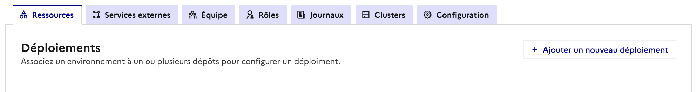
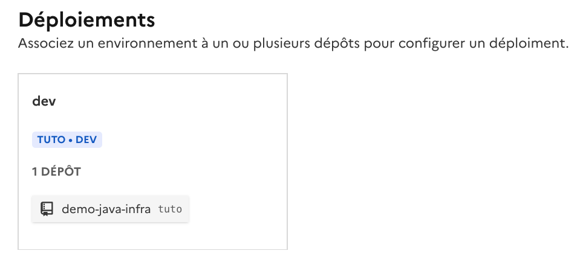
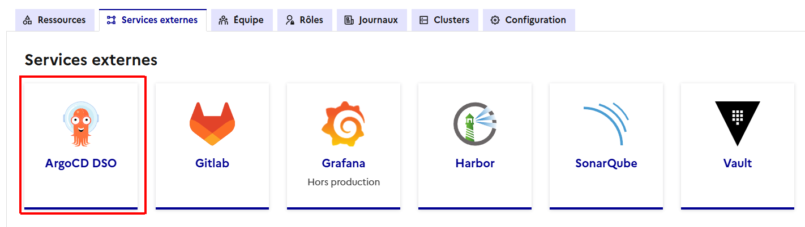
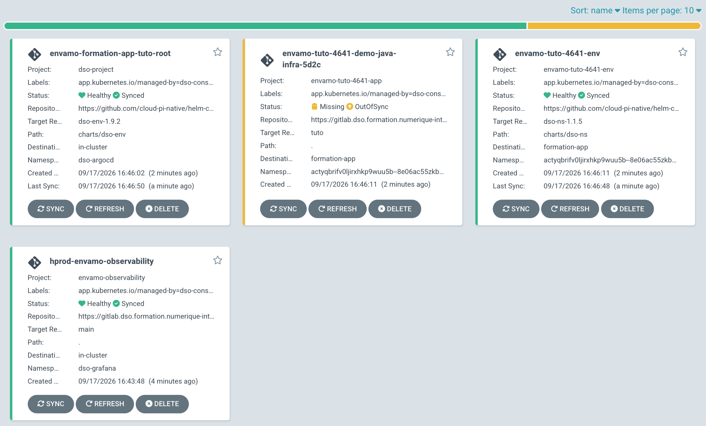
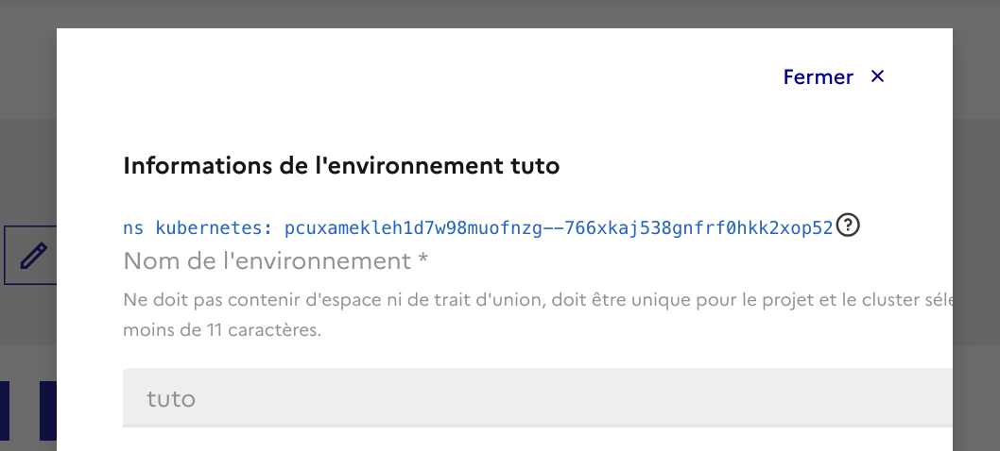
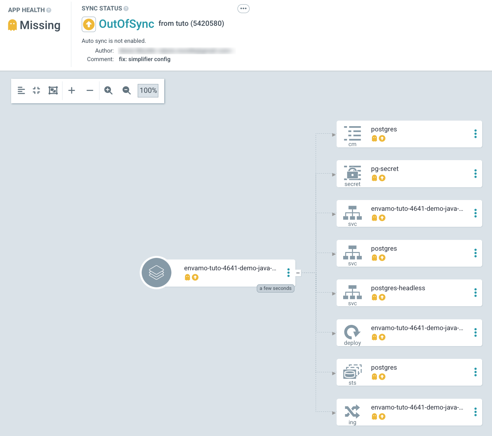
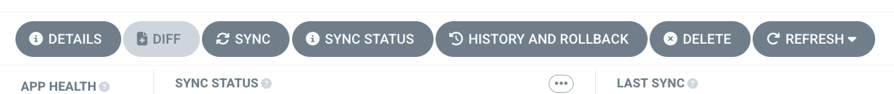
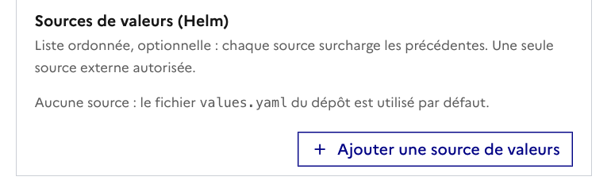
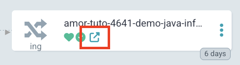

# Chart HELM de démonstration sur Cloud Pi Native

Vous en êtes à l'étape 4 de la formation CPiN :
1. [Gestion des projets CPiN](https://github.com/cloud-pi-native/formation-cpin-gestion-projet)
2. [Application d'exemple pour déploiement sur CPiN](https://github.com/cloud-pi-native/formation-cpin-repo-applicatif)
3. [Gestion des artefacts sur CPiN](https://github.com/cloud-pi-native/formation-cpin-harbor-trivy)
4. ➡️ [Chart HELM de démonstration sur CPiN](https://github.com/cloud-pi-native/formation-cpin-deploiement)
5. [Gestion des secrets sur CPiN](https://github.com/cloud-pi-native/formation-cpin-gestion-secret)
6. [Observabilité sur CPiN](https://github.com/cloud-pi-native/formation-cpin-observabilite)

## Présentation

> [!IMPORTANT]
> Il est nécessaire d'avoir construit au préalable l'image *java-demo* détaillée dans le tutoriel :
> [https://github.com/cloud-pi-native/formation-cpin-repo-applicatif](https://github.com/cloud-pi-native/formation-cpin-repo-applicatif).
> Il est indispensable d'avoir terminé ce tutoriel avant de poursuivre.

Le déploiement d'un applicatif sur CPiN passe par la création d'un dépôt de code applicatif contenant les éléments
d'infrastructure Kubernetes et/ou Openshift (manifestes YAML, charts HELM ou Kustomize). Dans cet exemple, le code
d'infrastructure est un chart HELM qui déploie l'image ***java-demo*** créée précédemment.

Ce chart permet de :
- Créer une instance PostgreSQL en faisant appel à un chart dédié
- Créer un déploiement de l'image construite lors du TP précédent
- Créer un service sur le déploiement
- Créer un ingress vers le service

## Intégration à la chaine CPiN

### Ajout du dépôt externe

Nous allons détailler l'intégration du dépôt d'infra de démo à l'offre Cloud Pi Native sur la plateforme
d'accélération.

Dans un premier temps, il est nécessaire d'ajouter le **dépôt de code d'infrastructure** au projet contenant la
construction de l'application *java-demo* :

▶️ Depuis votre *projet*, allez dans l'onglet `Dépôt`, puis `+ Ajouter un nouveau dépôt`, puis utilisez les paramètres
suivants :
- `Nom du dépôt Git interne` : **demo-java-infra**
- `Dépôt contenant du code d'infrastructure` : **cochez la case**
- `Url du dépôt Git externe` : **https://github.com/cloud-pi-native/formation-cpin-deploiement.git**
- `Nom de la révision à déployer` : **tuto**
- `Chemin du répertoire à déployer` : **laissez ce champ vide** (par défaut `./`)
- `Fichiers values` : **laissez ce champ vide** (par défaut `values.yaml`)

> [!NOTE]
> Dans les versions à venir de la console, les 3 derniers champs qui sont liés au déploiement vont devenir obsolètes
> dans la définition d'un dépôt d'infrastructure. Vous pourrez retrouver ces champs dans un élément de configuration
> dédié appelé `déploiement` que nous allons voir plus bas.

▶️ Cliquez sur le bouton `Ajouter le dépôt` et attendez que le dépôt apparaisse dans la console CPiN.

▶️ Depuis l'onglet `Services externes`, vérifiez en cliquant sur le service GitLab que le dépôt *demo-java-infra* est
bien présent dans vos projets GitLab.

### Création d'un environnement

Afin de déployer l'application, il est nécessaire de créer un environnement depuis la console CPiN.

▶️ Pour cela, allez dans l'onglet `Ressources` puis dans le menu `Environnements`. Cliquez sur le bouton
`+ Ajouter un nouvel environnement`. Utilisez les paramètres suivants :
- `Nom de l'environnement` : **tuto**
- `Zone` : **DSO** (sur l'environnement d'accélération, une seule zone est disponible)
- `Type d'environnement` : **dev**
- `Cluster` : **formation-app** (ce cluster est dédié aux exercices et peut être facilement purgé)
- `Mémoire allouée` : 8
- `CPU alloué` : 4
- `GPU alloué` : 0
- `Synchronisation automatique` : **décochez la case** (permet d'éviter de commencer à déployer le projet tant qu'il
n'est pas complètement configuré)

> [!IMPORTANT]
> Pour vos futurs environnements, donnez-leur un nom logique (demo, dev, integ, prod, etc). Le nom doit être court
> parce qu'il est réutilisé dans les objets Kubernetes dont les noms sont limités à 63 caractères.

> [!IMPORTANT]
> Le choix d'un type d'environnement permet de filtrer les dimensionnements proposés. Pour rappel, nous avions défini à
> la création du projet, dans l'étape 1 de la formation, des valeurs de dimensionnement pour les environnements de
> *hors-production* et de *production*.

▶️ Cliquez sur le bouton `Ajouter l'environnement` et attendez que l'environnement apparaisse dans la console CPiN.

## Déploiement de l'application

> [!NOTE]
> Aujourd'hui, lorsqu'un projet contient un repo d'infrastructure et (au moins) un environnement, la console CPiN crée
> automatiquement les applications *ArgoCD* associées. Les versions récentes de la console ont introduit la notion de
> déploiement pour permettre de déployer un ou plusieurs dépôts d'infrastructure dans un environnement.

### Création d'un déploiement

Vous pouvez retrouver les déploiements dans l'onglet `Ressources` avec les dépôts et les environnements.



▶️ Cliquez sur `+ Ajouter un nouveau déploiement` et utilisez les paramètres suivants :
- `Nom du déploiement` : **dev**
- `Environnement cible` : **tuto** (ou le nom de votre environnement créé plus haut)
- `Dépôt` : **demo-java-infra**
- `Nom de la révision à déployer` : **tuto**
- `Chemin du répertoire à déployer` : **laissez ce champ vide** (par défaut `.`)

▶️ Cliquez sur le bouton `Enregistrer` et attendez que le déploiement apparaisse dans la console.



### ArgoCD

▶️ Depuis le menu `Services externes`, cliquez sur la tuile *ArgoCD DSO*. Authentifiez-vous en appuyant sur le bouton
*login via Keycloak*.



> [!NOTE]
> Par défaut, en accédant à ArgoCD depuis la console CPiN, un filtre sur le nom de votre application est déjà appliqué.
> Celle-ci peut mettre quelques minutes à s'afficher le temps qu'elle soit créée.

Une fois connecté à ArgoCD, 4 applications sont visibles. Elles correspondent à votre infrastructure et votre stack
d'observabilité. Vous devriez donc retrouver les applications suivantes :
- ***[NOM_PROJET]-formation-app-[NOM_ENV]-root*** : application chapeau de votre projet
(e.g. monprojet-formation-app-tuto-root)
- ***[NOM_PROJET]-[NOM_ENV]-[ID]-[NOM_DEPOT]-[RANDOM]*** : application ArgoCD du dépôt infra que l'on a déclaré
depuis la console CPiN, c'est le déploiement de notre application (e.g. monprojet-tuto-4641-demo-java-infra-5d2c)
- ***[NOM_PROJET]-[NOM_ENV]-[ID]-env*** : socle technique de l'environnement (namespace, quotas, secrets), créé par
la console CPiN (e.g. monprojet-tuto-4641-env)
- ***hprod-[NOM_PROJET]-observability*** : dashboards as code (e.g. hprod-monprojet-observability), il sera abordé
dans le tuto sur l'observabilité à l'étape 6



> [!NOTE]
> Une autre application nommée *"prod-[NOM_PROJET]-observability"* peut également être présente si au moins un
> environnement de type production est déployé.

▶️ Afin de vérifier les paramètres de notre application, choisissez votre application de type
***[NOM_PROJET]-[NOM_ENV]-[ID]-demo-java-infra-[RANDOM]*** puis cliquez sur le bouton `Details` en haut à gauche. Ce
menu présente les informations principales de l'application ArgoCD :
- Le cluster et le namespace de déploiement
- Le dépôt Git associé (*REPO URL*)
- La branche utilisée sur le dépôt (*TARGET REVISION*)
- Le répertoire dans lequel chercher les éléments d'infrastructure (*PATH*)

> [!NOTE]
> Vous pouvez par exemple retrouver le namespace Kubernetes de votre application dans les détails de l'application dans
> ArgoCD et vérifier que vous avez bien la même valeur dans les détails de votre environnement dans la console.



> [!NOTE]
> Il n'est pas possible de modifier ces éléments depuis cette IHM ArgoCD. Pour les modifier, il faut le faire dans
> votre déploiement dans la console CPiN.

Les éléments à vérifier de façon générale sont :
- La branche utilisée par défaut. Il est possible de la modifier dans le champ ***Nom de la révision à déployer***,
dans la configuration de votre déploiement depuis la console CPiN. Il est même courant d'utiliser une branche dédiée
dans le cadre d'un workflow Git spécifique. Dans notre exemple, nous utilisons la branche tuto.
- Le répertoire dans lequel chercher les éléments d'infrastructure : par défaut, la console CPiN utilise le répertoire
racine du projet `./`. Si vous avez un fonctionnement différent, il faut également le mettre à jour dans la console
CPiN et remplacer la valeur du champ ***Chemin du répertoire à déployer*** au sein de votre déploiement.

Puisque nous avons décoché la case `Synchronisation automatique` depuis la console CPiN, l'application devrait
apparaitre dans un état *OutOfSync*.



▶️ Il est nécessaire de déployer l'application à la main. Pour cela, cliquez sur le bouton `SYNC` dans le menu haut
puis `SYNCHRONIZE` pour déployer l'application.



> [!IMPORTANT]
> Une fois que l'application est synchronisée, l'application devrait apparaitre en erreur. À ce stade, ce statut est
> attendu parce qu'il manque encore quelques éléments de configuration.

### Configuration de l'application

L'application n'est pas opérationnelle parce que les informations par défaut dans les fichiers de l'exercice ne
correspondent pas à votre environnement. Il faut corriger :
- Les références à Harbor
- L'URL de déploiement de l'application

Avant de corriger ces informations, attardons-nous une minute sur la visualisation des détails de ces erreurs.
Les éléments en erreur apparaissent sous la forme d'un petit cœur brisé 💔.

▶️ Consultez les événements en cliquant sur votre application puis sur le *POD* en erreur. Un panneau avec les
détails du *POD* s'affiche, allez sur l'onglet `EVENTS`. À noter qu'il est également possible de consulter les logs
des *PODS* sur l'onglet `LOGS` situé à côté.

Pour corriger les erreurs, nous allons ajouter un fichier *values* avec les paramètres manquants dans le dépôt Git.

> [!CAUTION]
> Pour rappel, le fonctionnement standard de CPiN serait de faire nos modifications depuis le dépôt externe sur Github
> puis de procéder à une synchronisation via le pipeline de l'application *mirror*. Pour des raisons pratiques
> (notamment pour éviter à tout le monde de modifier la même source GitHub), nous allons ajouter le fichier *values*
> directement dans votre dépôt GitLab CPiN.

▶️ Depuis GitLab, allez dans le projet `demo-java-infra` et vérifiez que vous êtes bien à la racine du projet et sur la
branche `tuto` en haut à gauche. Ensuite, cliquez sur le bouton `+`>`New file`. Appelez votre fichier
`values-demo.yaml`.

▶️ Ajoutez le contenu suivant :
```yaml
image:
  repository: harbor.dso.formation.numerique-interieur.fr/[NOM_PROJET]/[NOM_IMAGE]
  tag: "tuto"

ingress:
  host: [NOM_PROJET].app.formation.numerique-interieur.fr
```

Il faut adapter le contenu du fichier avec les informations de votre projet :
- **image.repository** : correspond à l'emplacement sur Harbor de l'image construite dans le tuto précédent
- **tag**: tag de l'image sur Harbor
- **ingress.host** : Nom DNS de l'application

▶️ Pour connaitre l'URL complète du dépôt de votre image à remplir dans **image.repository**, allez dans la console
CPiN puis cliquez sur le bouton `Afficher les secrets des services`. Dans le bloc *Harbor*, vous allez retrouver la
racine de déploiement des images du projet sous le format suivant :
> *harbor.dso.formation.numerique-interieur.fr*/**[NOM_PROJET]**/.

▶️ Attention, pour que l'URL soit correcte, ajoutez le nom de l'image construite (**java-demo**) dans l'URL du repo qui
aura alors le format suivant :
> *harbor.dso.formation.numerique-interieur.fr/**[NOM_PROJET]***/**[NOM_IMAGE]**

▶️ Pour connaitre le **tag** de votre image, allez sur Harbor depuis la console CPiN. Cliquez sur votre image Docker et
retrouvez le tag dans la colonne *Tags*. Ce tag correspond généralement au nom de votre branche de déploiement. Pour le
tutoriel, mettez : ***tuto***.

Enfin, sur l'environnement d'accélération, la génération des DNS et des certificats est automatiquement gérée en
respectant les sous-domaines liés aux clusters. Pour plus d'informations, consultez la documentation
[DNS et certificat](https://github.com/cloud-pi-native/documentation-pax/blob/main/specificite-public-cloud.md).

▶️ Définissez l'**ingress.host** en utilisant le nom de votre projet et en respectant le format proposé dans le
fichier.

> [!WARNING]
> Attention, ce nom doit être unique.

▶️ Une fois que le fichier est créé, *commit* puis *push* sur le dépôt GitLab, retournez sur la console CPiN et ouvrez
votre déploiement dans l'onglet `Ressources`.

▶️ Dans la section *Sources de valeurs (Helm)*, cliquez sur `+ Ajouter une source de valeurs`.



▶️ Ajoutez le fichier values que nous venons de créer en sélectionnant le type `Interne` et en remplissant le champ
`Chemin du fichier de valeurs` avec ***values-demo.yaml***. Cliquez sur `Enregistrer`.

▶️ Comme précédemment, la synchronisation automatique n'étant pas activée, retournez dans votre application sur ArgoCD
et cliquez sur le bouton *SYNC* puis *SYNCHRONIZE* pour voir s'appliquer vos modifications. Si votre application
n'apparait pas dans l'état *OutOfSync*, patientez quelques secondes le temps que les paramètres de déploiement soient
appliqués.

> [!TIP]
> Pour activer la synchronisation automatique, vous pouvez aller dans les paramètres de votre environnement dans la
> console.

### Vérification

Une fois le déploiement terminé et opérationnel, le statut de votre application devrait apparaitre *Healthy* ainsi que
tous les éléments de l'infrastructure 💚. Vous pouvez directement vous rendre sur l'URL configurée dans **ingress.host**
mais vous pouvez également la retrouver sur ArgoCD via l'objet *ingress*.



Si tout est correctement configuré, la page devrait vous renvoyer la liste de personnes présentes dans la base de
données au format JSON.

```json
[
  {
    "id": 1,
    "name": "Alice"
  },
  {
    "id": 2,
    "name": "Bob"
  },
  {
    "id": 3,
    "name": "Charles"
  },
  {
    "id": 4,
    "name": "Denis"
  },
  {
    "id": 5,
    "name": "Emily"
  }
]
```

Bravo, vous avez terminé la partie déploiement de la formation CPiN !

Vous pouvez passer à l'étape 5 : [Gestion des secrets sur CPiN](https://github.com/cloud-pi-native/formation-cpin-gestion-secret)
